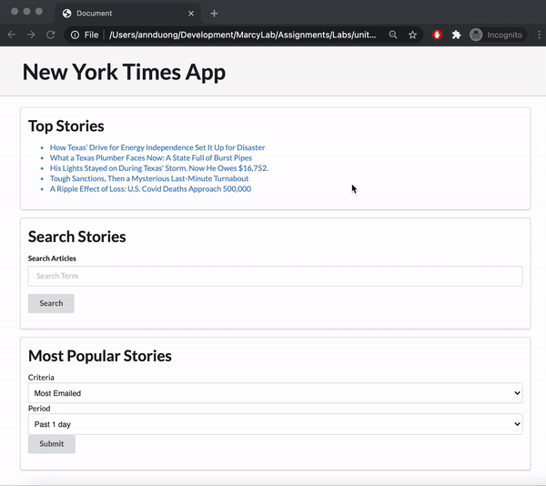

# New-York-Times-API-lab

You will be using many [APIs from the New York Times](https://developer.nytimes.com/). 

## Demo

Study the gif below to get a feel for what you'll be building.



## Create a Dev Account with NYT and get an API-Key

Follow [these instructions](https://developer.nytimes.com/get-started). 
* First, create an account and sign in. 
* Then, select the drop down in the otp right corner and select "Apps". 
* Click the "+ NEW APP" button.
* The New York Times will assume you are a developer who plans on creating an app that uses their APIs. Since we are not making a _real_ application, and since we're just using these APIs for our lab, you can give this an App Name of "Marcy Lab Practice". 
* Scroll down and make sure you click "Enable" for **all** the APIs. 
* Hit the SAVE button.


You'll be given an API-key, which you will need to use as a query parameter in **ALL** your `fetch` requests to these APIs. Familize yourself with [all the APIs](https://developer.nytimes.com/apis) the New York Times has to offer!


> As a best practice, you should not expose your API Key by pushing it to Github. We recommend creating a seperate `.js` file to store your API key as a JavaScript variable, then adding a script tag connecting that file in your HTML, and then referencing that variable in your `index.js`. [Read about how to do that here](https://dev.to/ptprashanttripathi/how-to-hide-api-key-in-github-repo-2ik9).

## Build your Web App!

Create the needed project files to build the web app that resembles the gif above. You can use `index.html` as a starting point. This lab uses Semantic UI for CSS, so you might see some css class names you don't recognize. That's ok! 

You should build out each of the following features one at a time, coding a little and testing a little as you go.

## Feature 1: Top Stories

When your web app loads, we should see a list of 5 **Top Stories** by the New York Times at the top of the page. These should be the same story titles as the [New York Times homepage](https://www.nytimes.com/). Use the [Top Stories API](https://developer.nytimes.com/docs/top-stories-product/1/overview) to get your data. Your lists should be directy links to the articles.

See below for an example of what your DOM should look like:

```html
<ul id="top-stories">
  <li><a href="https://www.nytimes.com/ukraine-russia-war...html">Ukraine Russia War</a></li>
  <li><a href="https://www.nytimes.com/rihanna-superbowl...html">Rihanna Superbowl</a></li>
  <li><a href="https://www.nytimes.com/railroad-crash...html">Railroad Crash</a></li>
  <li><a href="https://www.nytimes.com/...html">Marcy Lab Make History</a></li>
  <li><a href="https://www.nytimes.com/...html">Economy Improving</a></li>
</ul>
```


## Feature 2: Search Stories

Below your Top Stories is a form where the user can search for news articles. Use the [Article Search API](https://developer.nytimes.com/docs/articlesearch-product/1/routes/articlesearch.json/get). Your form only needs to handle one text input and one submit button. When a user submits the form, your web app should display 10 article links. If the user makes another search by re-submitting the form, the previous search results should be "cleared out" and you should see the new search results. 


## Feature 3: Most Popular Stories

New York Times defines three ways to get the most popular stories: [Most Emailed](https://developer.nytimes.com/docs/most-popular-product/1/routes/emailed/%7Bperiod%7D.json/get), [Most Shared](https://developer.nytimes.com/docs/most-popular-product/1/routes/shared/%7Bperiod%7D.json/get), and [Most Viewed](https://developer.nytimes.com/docs/most-popular-product/1/routes/viewed/%7Bperiod%7D.json/get). Your web app should have a form that consists of a dropdown that has options: `Most Emailed, Most Shared, or Most Viewed`, another dropdown that has options for the period: `Past 1 day, Past 7 days, or Past 30 days`, and a submit button. When the form is submitted, it will display the 3 most popular article links within that period. If the user makes another search by re-submitting the form, the previous search results should be "cleared out". 


> For example, submitting the form when the selected options are "Most Emailed" and "Past 7 days" will make a request to `https://api.nytimes.com/svc/mostpopular/v2/emailed/7.json`. 

## Bonus: Build your own feature(s)

The New York Times APIs have so much data. Create your own feature(s), but it must be intuitive for your user to understand what the feature is and how to use it. 
